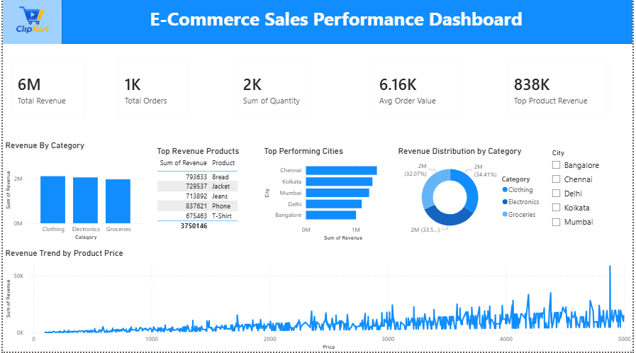

# Sales Performance Dashboard

## Overview
This project presents an interactive Sales Performance Dashboard developed using Power BI to analyze sales trends, revenue performance, and key business metrics.  
The dashboard enables users to explore data through interactive visualizations and gain actionable insights for decision-making.

## Tools & Technologies
- Power BI
- Power Query
- DAX
- Microsoft Excel

## Key Features
- Interactive KPI Cards
- Revenue and Sales Trend Analysis
- Product Category Performance Analysis
- Region-wise Sales Insights
- Dynamic Filtering using Slicers
- Average Order Value (AOV) Calculation

## Key Metrics
- Total Revenue
- Total Orders
- Average Order Value (AOV)
- Category-wise Sales Performance
- Region-wise Sales Performance

## Dashboard Preview

### Dashboard Screenshot

## Business Insights
- Identified top-performing product categories.
- Analyzed revenue trends across different regions.
- Evaluated order volume and customer purchasing behavior.
- Enabled data-driven decision-making through interactive reporting.

## Project Structure
